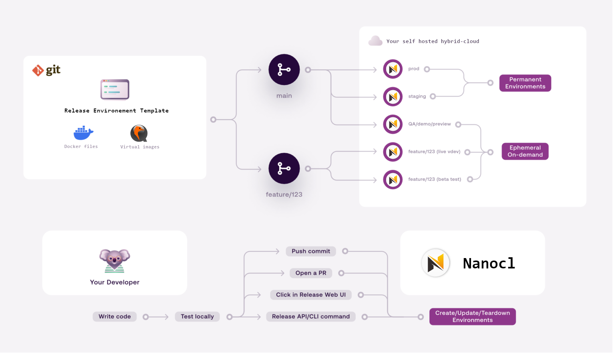

  <h1><strong>nanocl</strong></h1>
  
  <h1><strong>self-sufficient hybrid-cloud</strong> </h1>

  
Environment as Services

  
<strong>EaaS</strong>

  
Create on demand or persistant highly scalable environment

  

## Summary

- [Installation](./doc/guides/installation/)
- [Documentation](./doc/)

## Contribution

If you want to contribute see [development](./DEVELOPING.md) section to see how
to setup a dev environement for nanocl
